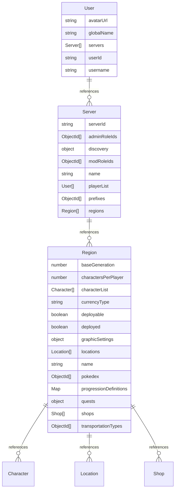

# Entity Relationship Diagram

**Generated:** 2026-02-27T01:33:42.708Z

## Diagram

## Entities

### User

| Field        | Type     | Required | Notes              |
| ------------ | -------- | -------- | ------------------ |
| `avatarUrl`  | string   |          |                    |
| `globalName` | string   | ✓        |                    |
| `servers`    | Server[] | ✓        | References: Server |
| `userId`     | string   | ✓        |                    |
| `username`   | string   | ✓        |                    |

### Server

| Field          | Type       | Required | Notes              |
| -------------- | ---------- | -------- | ------------------ |
| `serverId`     | string     | ✓        |                    |
| `adminRoleIds` | ObjectId[] | ✓        |                    |
| `discovery`    | object     | ✓        |                    |
| `modRoleIds`   | ObjectId[] | ✓        |                    |
| `name`         | string     | ✓        |                    |
| `playerList`   | User[]     | ✓        | References: User   |
| `prefixes`     | ObjectId[] | ✓        |                    |
| `regions`      | Region[]   | ✓        | References: Region |

### Region

| Field                    | Type        | Required | Notes                 |
| ------------------------ | ----------- | -------- | --------------------- |
| `baseGeneration`         | number      | ✓        |                       |
| `charactersPerPlayer`    | number      | ✓        |                       |
| `characterList`          | Character[] |          | References: Character |
| `currencyType`           | string      | ✓        |                       |
| `deployable`             | boolean     | ✓        |                       |
| `deployed`               | boolean     | ✓        |                       |
| `graphicSettings`        | object      | ✓        |                       |
| `locations`              | Location[]  | ✓        | References: Location  |
| `name`                   | string      | ✓        |                       |
| `pokedex`                | ObjectId[]  | ✓        |                       |
| `progressionDefinitions` | Map         | ✓        |                       |
| `quests`                 | object      | ✓        |                       |
| `shops`                  | Shop[]      | ✓        | References: Shop      |
| `transportationTypes`    | ObjectId[]  | ✓        |                       |

## Relationships

| From   | To        |
| ------ | --------- |
| User   | Server    |
| Server | User      |
| Server | Region    |
| Region | Character |
| Region | Location  |
| Region | Shop      |
