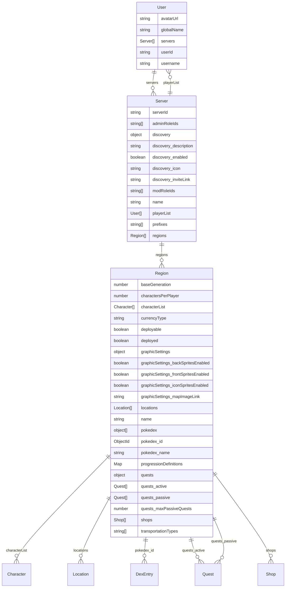

# Entity Relationship Diagram

**Generated:** 2026-02-27T22:21:12.865Z

## Diagram

## Entities

### User

| Field | Type | Required | Notes |
|-------|------|----------|-------|
| `avatarUrl` | string |  |  |
| `globalName` | string | ✓ |  |
| `servers` | Server[] | ✓ | References: Server |
| `userId` | string | ✓ |  |
| `username` | string | ✓ |  |

### Server

| Field | Type | Required | Notes |
|-------|------|----------|-------|
| `serverId` | string | ✓ |  |
| `adminRoleIds` | string[] | ✓ |  |
| `discovery` | object | ✓ |  |
| `↳ description` | string |  |  |
| `↳ enabled` | boolean | ✓ |  |
| `↳ icon` | string |  |  |
| `↳ inviteLink` | string |  |  |
| `modRoleIds` | string[] | ✓ |  |
| `name` | string | ✓ |  |
| `playerList` | User[] | ✓ | References: User |
| `prefixes` | string[] | ✓ |  |
| `regions` | Region[] | ✓ | References: Region |

### Region

| Field | Type | Required | Notes |
|-------|------|----------|-------|
| `baseGeneration` | number | ✓ |  |
| `charactersPerPlayer` | number | ✓ |  |
| `characterList` | Character[] |  | References: Character |
| `currencyType` | string | ✓ |  |
| `deployable` | boolean | ✓ |  |
| `deployed` | boolean | ✓ |  |
| `graphicSettings` | object | ✓ |  |
| `↳ backSpritesEnabled` | boolean |  |  |
| `↳ frontSpritesEnabled` | boolean |  |  |
| `↳ iconSpritesEnabled` | boolean |  |  |
| `↳ mapImageLink` | string |  |  |
| `locations` | Location[] | ✓ | References: Location |
| `name` | string | ✓ |  |
| `pokedex` | object[] | ✓ |  |
| `↳ id` | ObjectId |  | References: DexEntry |
| `↳ name` | string |  |  |
| `progressionDefinitions` | Map | ✓ |  |
| `quests` | object | ✓ |  |
| `↳ active` | Quest[] | ✓ | References: Quest |
| `↳ passive` | Quest[] | ✓ | References: Quest |
| `↳ maxPassiveQuests` | number |  |  |
| `shops` | Shop[] | ✓ | References: Shop |
| `transportationTypes` | string[] | ✓ |  |

#### Map: `progressionDefinitions`

**Value Type:** `Schema`

| Field | Type | Required | Notes |
|-------|------|----------|-------|
| `kind` | string | ✓ |  |
| `name` | string | ✓ |  |
| `description` | string |  |  |
| `visibility` | string |  |  |
| `min` | number |  |  |
| `max` | number |  |  |
| `sequential` | boolean |  |  |
| `milestones` | object[] |  |  |
| `↳ milestones.key` | string | ✓ |  |
| `↳ milestones.label` | string | ✓ |  |
| `↳ milestones.description` | string |  |  |
| `↳ milestones.imageUrl` | string |  |  |
| `↳ milestones.ordinal` | number |  |  |

## Relationships

| From | Field | To |
|------|-------|----|
| User | `servers` | Server |
| Server | `playerList` | User |
| Server | `regions` | Region |
| Region | `characterList` | Character |
| Region | `locations` | Location |
| Region | `pokedex_id` | DexEntry |
| Region | `quests_active` | Quest |
| Region | `quests_passive` | Quest |
| Region | `shops` | Shop |
